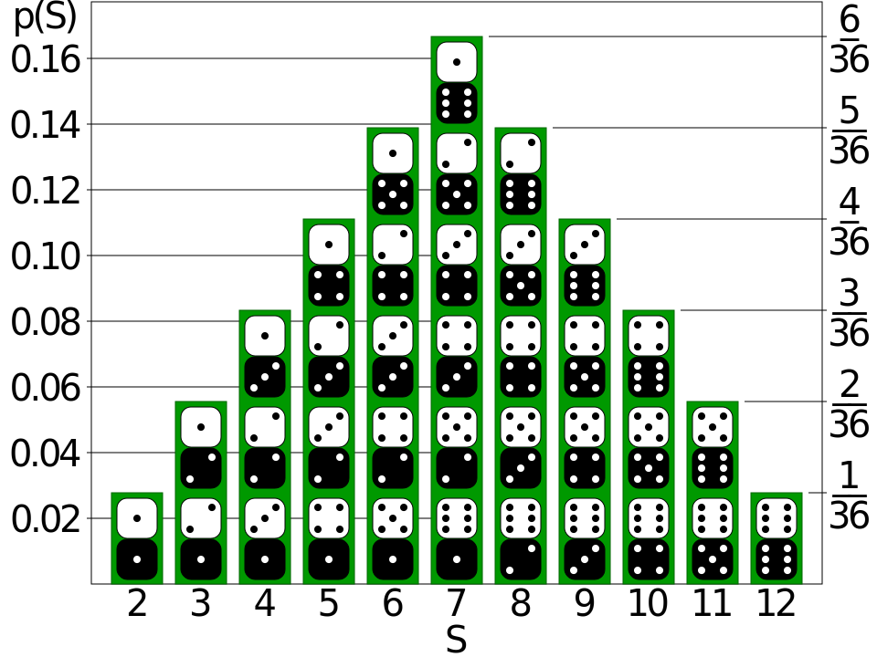

# Lab | Statistics Foundations

* *Beto Sibileau*. Data Barcelona (FT), April 2020.

## Challenges
### Challenge 1
One player rolls two dices. Describe the measurable space and the random variable for different scenarios.
* The values that the player obtains (case **A**).
* The sum of the values obtained (case **B**).
* The maximum value obtained after rolling both dices (case **C**).

In addition, describe the following events:
* Both values are greater than 5 (case **A**).
* The sum of values is even (case **B**).
* The maximum is the value of both rolls (case **C**).

#### Answers

By definition, a random variable is a function $X$ that operates from a set of possible outcomes $\Omega$ to a measurable space $E$, that is $\displaystyle X\colon \Omega \to E$.

* Set of possible outcomes for case **A** is formed by tuples in $\Omega=\{(1,1),(1,2),(1,3),(1,4),(1,5),(1,6),(2,2),(2,3),(2,4),(2,5),(2,6),(3,3),(3,4),(3,5),(3,6),(4,4),(4,5),(4,6),(5,5),(5,6),(6,6)\}$, while the measurable space is the probability of getting any of the tuples, that is $E=\mathcal{P}(X)$. For the six tuples "$x_e$" where numbers are equal we have a probability of $\mathcal{P}(x_{e})=\displaystyle\frac{1}{36}$ whereas for tuples "$x_d$" where numbers differ we have a probability of $\mathcal{P}(x_{d})=\displaystyle\frac{1}{18}$.

* We use for case **B** $S$ as the random variable "Sum" that operates on possible outcomes formed by integers from 2 to 12 (both inclusive), that is $\Omega=\{i\}$ for $i=2,3,...,12$. The measurable space $E=\mathcal{P}(S)$ is still the probability, which is depicted the Figure below:

* For case **C**, we have $M$ the random variable for the "Max" that operates on these possible outcomes $\Omega=\{i\}$ for $i=1,2,...,6$, which is the same as rolling one dice only. The measurable space $E=\mathcal{P}(M)$ is the probability, being this one $\mathcal{P}(m_i)=\displaystyle\frac{2\,i-1}{36}$ correspondingly to all elements $m_i \in \Omega$ for $i=1,2,...,6$.

It is described below the probabilities that correspond to the events mentioned for this challenge:

* Probability that both values are greater than 5 (case **A**): $\mathcal{P}(x|_{>5})=\displaystyle\frac{1}{36}$.
* Probability that the sum of values is even (case **B**): $\mathcal{P}(s|_{\mathrm{even}})=\displaystyle\frac{1}{2}$
* Probability that the maximum is the value of both rolls (case **C**): $\mathcal{P}(m|_{\mathrm{equal}})=\displaystyle\frac{1}{6}$

<!---
$\displaystyle \left(\!\!\!{{6} \choose 2}\!\!\!\right)={6 + 1 \choose 2}=\frac{( 6 + 1 )!}{2!\,( 6 - 1 )!}\,.$

$\displaystyle \Omega$ \Omega  to a measurable space {\displaystyle E}E
{#fig:PMFsum}

all elements $x_i \in \Omega$, then $\mathcal{P}(x_i)=\displaystyle\frac{1}{\left(\!{{6} \choose 2}\!\right)}$, where $\displaystyle\left(\!\!\!{{6} \choose 2}\!\!\!\right)=21$ is know as "6 *multichoose* 2".

-->

### Challenge 2
One player picks two cards from a poker deck. Describe the measurable space and the random variable for:
* The number of figures he picks (case **A**).
* The sum of card values. Consider that the value of figures is 10 and the value of aces is 15 (case **B**).
* The number of hearts or spades he picks (case **C**).

Describe the following events:
* The number of figures in the cards the player picked is two (case **A**).
* The sum of card values is 17 (case **B**).
* The value of both cards is less than 8 (case **C**).

#### Answers

* We use for case **A**, $F$ as the random variable "Figures", with a set of possible outcomes $\Omega=\{0,1,2\}$. The measurable space is the probability of getting any of the possible outcomes, that is $E=\mathcal{P}(F)$. We have that $\mathcal{P}(f_{0})=\displaystyle\frac{105}{221}$, $\mathcal{P}(f_{1})=\displaystyle\frac{96}{221}$ and $\mathcal{P}(f_{2})=\displaystyle\frac{20}{221}$, being $\mathcal{P}(f_{i})$ the probability of getting figure $f_i$ number of figures for $i=0,1,2$.

* We use for case **B**, $S_{\mathrm{f}}$ as the random variable for the "Sum" of "Figures", with a set of possible outcomes $\Omega=\{0,10,15,20,25,30\}$. The measurable space is the probability of getting any of the possible outcomes, that is $E=\mathcal{P}(S_{\mathrm{f}})$. We have that $\mathcal{P}(s_{0})=\displaystyle\frac{105}{221}$, $\mathcal{P}(s_{10})=\displaystyle\frac{72}{221}$, $\mathcal{P}(s_{15})=\displaystyle\frac{24}{221}$, $\mathcal{P}(s_{20})=\displaystyle\frac{11}{221}$, $\mathcal{P}(s_{25})=\displaystyle\frac{8}{221}$ and $\mathcal{P}(s_{30})=\displaystyle\frac{1}{221}$ being $\mathcal{P}(s_{i})$ the probability of getting a sum of two figures $s_i$ for $i=0,10,15,20,25,30$.

* We use for case **C**, $Hs$ as the random variable for the number of "Hearts" or "Spades" picked, with a set of possible outcomes $\Omega=\{0,1,2\}$. The measurable space is the probability of getting any of the possible outcomes, that is $E=\mathcal{P}(Hs)$. We have that $\mathcal{P}(hs_{0})=\mathcal{P}(hs_{2})=\displaystyle\frac{25}{102}$ and $\mathcal{P}(hs_{1})=\displaystyle\frac{26}{51}$, being $\mathcal{P}(hs_{i})$ the probability of getting a number of hearts or spades $hs_i$ for $i=0,1,2$.

It is described below the probabilities that correspond to the events mentioned for this challenge:

* Probability that the number of figures in the cards picked is two (case **A**): $\mathcal{P}(f_{2})=\displaystyle\frac{20}{221}$.
* Probability that the sum of card values is 17 (case **B**): $\mathcal{P}(s_{17})=\displaystyle\frac{40}{663}$.
* Probability that the value of both cards is less that 8 (case **C**): $\mathcal{P}(hs|_{<8})=\displaystyle\frac{48}{221}$

<!--  and $\mathcal{P}(hs_{2})=\displaystyle\frac{20}{221}$ -->

<!-- I will consider that the possible figures are $J$, $Q$ and $K$.  -->

<!-- For the six tuples "$x_e$" where numbers are equal we have a probability of $\mathcal{P}(x_{e})=\displaystyle\frac{1}{36}$ whereas for tuples "$x_d$" where numbers differ we have a probability of $\mathcal{P}(x_{d})=\displaystyle\frac{1}{18}$. -->

### Challenge 3
Two players roll a dice. Describe the measurable space and the random variable for:
* The score of player A (case **A**).
* The greatest score (case **B**).
* The earnings of player A if the game rules state that:  
"The player with the greatest score gets a coin from the other player" (case **C**).
* The earnings of player A if the game rules state that:  
"The player with the greatest score gets as many coins as the difference between the score of player A and player B" (case **D**). 

Describe the following events:
* The score of player A is 2 (case **A**).
* The greatest score is lower or equal than 2 (case **B**).
* Considering the case where the winner gets as many coins as the difference between scores (case **D**), describe: 
  * Player A wins at least 4 coins.
  * Player A loses more than 2 coins.
  * Player A neither wins nor loses coins.

#### Answers

* The space of possible outcomes for a player (case **A**) is simply the values of a dice: $\Omega=\{i\}$, for $i=1,2,...,6$.
* The space of possible outcomes for the greatest score (case **B**) is also the values of a dice: $\Omega=\{i\}$, for $i=1,2,...,6$.
* The space of possible outcomes for player A earnings in case **C** is described by $\Omega=\{0,\pm1\}$, a set denoting either a tied round or wining/loosing a coin from the other player.
* The space of possible outcomes for player A earnings in case **D** is described by $\Omega=\{0,\pm i\}$, for $i=1,2,...,5$ a set denoting either a tied round or wining/loosing all possible non-zero differences $i$, for $i=1,2,...,5$, between two players rolling a dice.

It is described below the probabilities that correspond to the events mentioned for this challenge:

* The probability of player A to score a 2 in a dice roll is simply $\mathcal{P}(a_{2})=\displaystyle\frac{1}{6}$ (case **A**).
* The probability of the highest score lower or equal than 2 is $\mathcal{P}(\mathrm{max}|_{\leq2})=\displaystyle\frac{1}{9}$ (case **B**).
* Probabilities of events for case **D**
    * Player A wins at least 4 coins: $\mathcal{P}(a_{\mathrm{win}}|_{\geq4})=\displaystyle\frac{1}{12}$
    * Player A loses more than 2 coins: $\mathcal{P}(a_{\mathrm{loss}}|_{>2})=\displaystyle\frac{1}{6}$
    * Player A neither wins nor loses coins: $\mathcal{P}({\mathrm{tied}})=\displaystyle\frac{1}{6}$